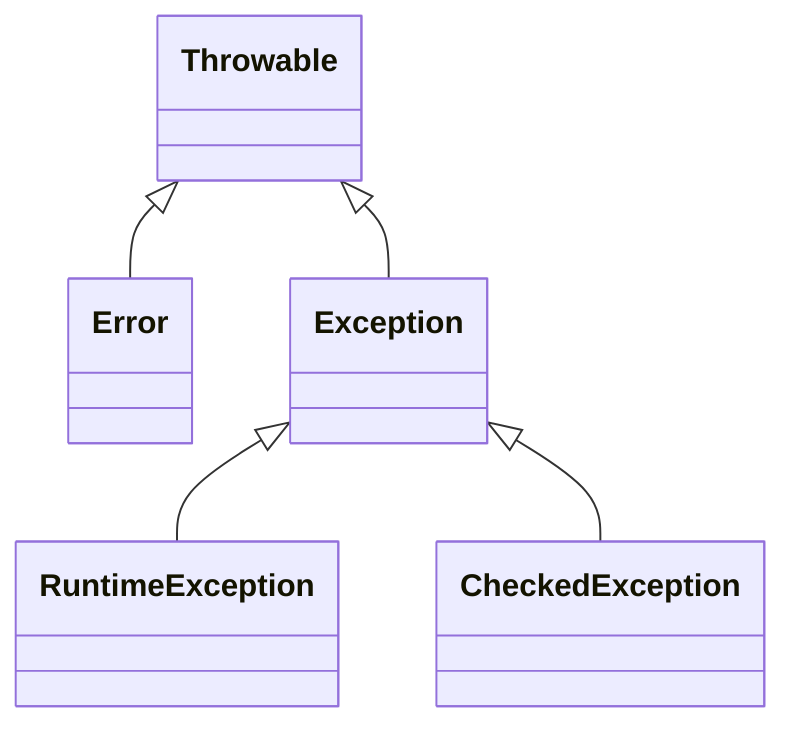

# Exception Handling in Java

```java
/*
 * All exceptions inherit from Throwable
 * 
 * Checked Exceptions: Must be handled (IOException, SQLException)
 * Unchecked Exceptions: Runtime (NullPointer, IndexOutOfBounds)
 */
```

## 🏗️ Exception Hierarchy



## 🛠️ Handling Mechanisms

1. Basic Try-Catch
```java
try {
    // Risky operation
    FileReader file = new FileReader("test.txt");
} catch (FileNotFoundException e) {
    System.out.println("File not found: " + e.getMessage());
} finally {
    System.out.println("This always executes");
}
```

2. Try-With-Resources (AutoCloseable)
```java
try (BufferedReader br = new BufferedReader(new FileReader("file.txt"))) {
    // Auto-closed after try block
    String line = br.readLine();
}
```

3. Throwing Exceptions
```java
public void withdraw(double amount) throws InsufficientFundsException {
    if (amount > balance) {
        throw new InsufficientFundsException(balance);
    }
}
```

## 📝 Exception Handling Best Practices

### ✅ Do's vs ❌ Don'ts

| ✅ Best Practices          | ❌ Common Pitfalls         |
|---------------------------|---------------------------|
| **Catch specific exceptions first** (e.g., `FileNotFoundException` before `Exception`) | **Catch `Throwable`** - May catch JVM errors that shouldn't be handled |
| **Use try-with-resources** for auto-closable objects (`Closeable`, `AutoCloseable`) | **Swallow exceptions** with empty catch blocks (hides errors) |
| **Include context** in error messages (e.g., "Failed to process user ID: 123") | **Use exceptions for normal flow control** (expensive, use boolean checks instead) |
| **Log exceptions properly** with stack traces (`logger.error("Context", e)`) | **Chain exceptions without context** (loses root cause information) |

## 🚨 Common Runtime Exceptions

| Exception Class                 | Typical Trigger Scenario                  | Prevention Tip                     |
|---------------------------------|------------------------------------------|------------------------------------|
| `NullPointerException`          | Calling methods on `null` reference       | Use `Objects.requireNonNull()`     |
| `ArrayIndexOutOfBoundsException`| Accessing array beyond its length         | Check array bounds with `.length`  |
| `ClassCastException`            | Invalid casting (`String` to `Integer`)   | Use `instanceof` checks first      |
| `IllegalArgumentException`     | Passing invalid arguments to methods      | Validate method inputs early       |


>### Pro Tip: Java 14+ Helpful NPEs
>```java
>// Before Java 14:
>Cannot invoke "String.length()" because "foo" is null
>
>// Java 14+ with -XX:+ShowCodeDetailsInExceptionMessages:
>Cannot invoke "String.length()" because the return value of "getFoo()" is null
>```

## 🏆 Advanced Topics

### Custom Exception
```java
public class PaymentFailedException extends RuntimeException {
    private final String transactionId;
    
    public PaymentFailedException(String txId, String message) {
        super(message);
        this.transactionId = txId;
    }
    
    public String getTransactionId() {
        return transactionId;
    }
}
```

### Exception Chaining

```java
try {
    processOrder();
} catch (OrderProcessingException e) {
    throw new PaymentFailedException("TX123", "Payment declined", e);
}
```

## 🔍 Debugging Tips

1. Print full stack trace:
```java
catch (Exception e) {
    e.printStackTrace();  // Log to stderr
    logger.error("Error processing request", e);  // Log properly
}
```

2. JVM Flags:
```java
-XX:+PrintExceptionStackTraces
-XX:OnError="kill -9 %p"
```

>💡 Pro Tip: Use Objects.requireNonNull() for null checks:
> ```java
> public void process(User user) {
> this.user = Objects.requireNonNull(user, "User cannot be null");
> }
>```